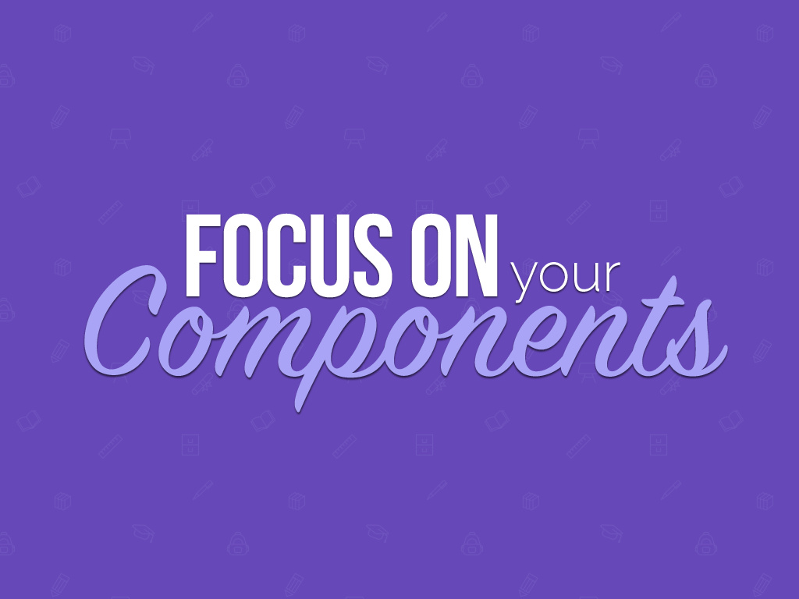
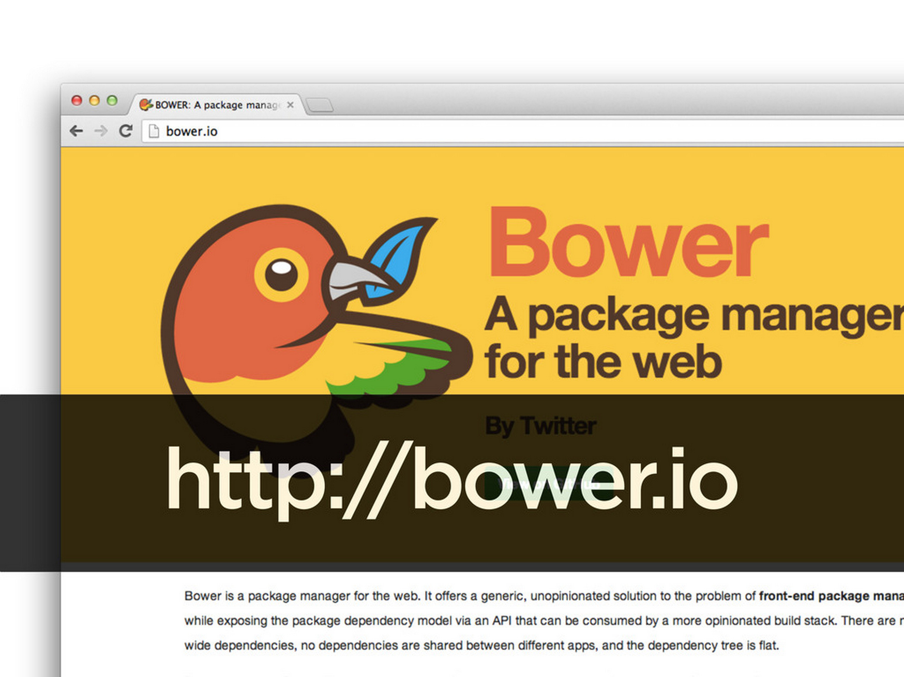
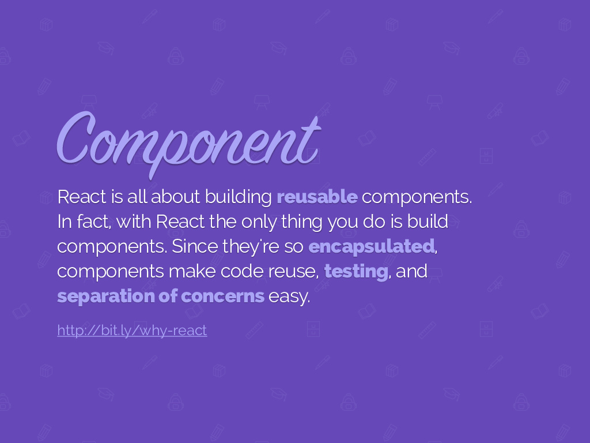

= Neo4j Slide Types
OpenDevise_Inc.
:imagesdir: images
:toc: macro

The following is a list of *proposed* slide types to help bring more structure to presentation decks and ease slide creation.
Each type consists of a definition, recommendations and a set of design concepts (from the wild) and design comps (recommendations).

toc::[]

== Title

.Definition
A _title slide_ contains the presentation title and, optionally, the name(s) of the speaker(s).
It's typically the opening slide in the presentation (unless there's a preshow).

.Purpose
You want to use this slide not only to introduce your presentation, but also to establish a setting.
Using a full bleed background image is the best way to define a stage, set the tone and give the presentation a unique identity.

.Suggestions
One way to use a background image while still retaining brand consistency is to select a background image for each topic.
Another is to use the same image but with a different angle or perspective per topic.
The audience will still associate the image with the brand, but you're able to get away from a boring, corporate-looking title slide.

For Neo, the background image may be a character or scene from the Matrix, thus using the imagery to suggest the topic.

.Bottom line
A well-designed title slide (as well as speaker slide) ensures your presentation makes a great first impression.
It also gives the audience the sense that a narrative is coming and that it's very professional.

//image::title-slide.jpg[]

== Speaker

.Also known as
Credentials

.Definition
A _speaker slide_ communicates information about the speaker to the audience.

.Suggestions
This slide should only contain the most essential information:

* Speaker name
* Speaker title
* Speaker headshot
* Up to two contact addresses (e-mail, link, screenname)

It's important to personalize this slide with a picture of yourself, but otherwise keep it lean.
The audience wants to get to know you, but they don't need your life story.
Remember, they are there to learn about the topic, not your life.
What's important is that they understand that if they need to contact you, the information is there for them to find later.
You may want to insert this slide again at the end of the presentation so you leave the audience with a way of contacting you.

.Bottom line
Introduce yourself and move on.

//A good example of this slide type can be found in the https://speakerdeck.com/pedronauck/reactjs-keep-simple-everything-can-be-a-component[Keep it Simple, Everything Can Be a Component] deck.

image::speaker-slide.jpg[]

== Agenda

.Definition
An _agenda slide_ contains a list of each major topic in the presentation, serving as the presentation's table of contents.

.Suggestions
This slide can be used to set the audience's expectations.
What can they expect to learn?
What's not covered?
Set up their internal progress bar so they can be prepared to take in all the information that's coming to them.

We envision this slide being generated automatically from the topic slides and, perhaps, inserted between each topic automatically to serve as a checkpoint in the presentation.

.Just say "`No`" to progress bars
****
We strongly recommend against using a progress bar on each slide.
That draws too much attention to the progress and away from the story.
You don't want them "`watching the clock`".
Instead, you want to maintain some mystery.

One interesting idea is to associate each agenda item with an icon and then use the list of icons as a way to show progress.
****

.Bottom line
The agenda slide can be used to give them a break, reward them by reminding them of what they've learned and ensure they only think about progress when you want them to.

image::agenda-slide-2.jpg[]

image::agenda-slide.jpg[]

=== Schedule

A _schedule slide_ is similar to an agenda, but it incorporates time and external events, such as a coffee break or lunch.
The content should be very high level so that the focus is on the _when_ and not the _what_.

It might help to use the familiar daily agenda-style layout (e.g., grid) to reinforce its purpose and make it easy to remember.
For instance, think of the agenda-style layout used for a conference schedule.

== Topic

.Definition
A _topic slide_ consists of a title (or statement) and, ideally, supporting imagery for that topic.
Only if it truly adds value should you consider including a subtopic as well, but make it subtle (e.g., subtext).

.Suggestions
These slides identify the presentation "`chapters`" and likely map back to an entry on the _agenda slide_.
Each topic slide will use one of several predefined layouts and either the same image throughout the presentation or an image per topic.

A topic slide helps transition from one topic to another.
It also gives the audience a short break, let's them come up for air and prepare their brains to start learning something new.

A good way to break up the monotony and rigidity of plain topics is to replace it with a question instead.
You are likely introducing a topic to answer a question or address a need.
So start off by posing the question or challenge and then use the material to address it.

.Bottom line
Don't give in to the temptation of adding content to the topic slide.
In other words, don't give anything away yet.
Let the topic sit out there and take hold in the audiences' brains.
Antici...

image::topic-slide-2.jpg[]

image::topic-slide-breadcrumbs.jpg[]

image::topic-slide-3.jpg[]

== Statement

.Also known as
Question, Advice

.Definition
A _statement slide_ reinforces the central point, takeaway or crux of a longer explanation or makes a transition (rising action) from one point to another.

.Suggestions
Since a statement slide is all about the words, you should leverage typography to its full extent to turn the words into imagery (see http://www.smashingmagazine.com/2012/06/subtle-typographic-choices-make-difference/[When Subtle Typographic Choices Make All The Difference] and http://www.smashingmagazine.com/2012/04/when-typography-speaks-louder-than-words/[When Typography Speaks Louder Than Words]).
The words should be big and bold or otherwise stand out.
A display font works best here.
Use color to make it less stark and to emphasize key words.

.Bottom line
You might think of the statement as something the audience records word-for-word in their notebook or tweets.
It also reminds the audience where they are in the narrative, grounds them or invites them alone with you on the journey.

image::statement-slide-2.jpg[]

== Subject

.Definition
Sometimes, you want to put a subject into the audience's mind so you can speak about it.
A _subject slide_ communicates the current subject (proper noun) of discussion.
It may be a photo of a person or place or another visual identifier (e.g., a logo).
If necessary, a caption can be added to explicitly label the subject, but it's most effective if the image can stand alone.

.Suggestions
It's tempting to want to crowd the slide with an assortment of (random) facts about the subject in the form of bullets.
_Don't do it!_
You want the audience to focus on what you are saying, your message, not trying to figure out what all the facts mean and how they relate to what you're jabbering on about.

=== URL

.Definition
A _URL slide_ is a specialized subject slide that's main intent is to share a URL.

.Suggestions
Whenever you share a URL, you should include a screenshot of where that URL leads so that the audience knows what to expect and are confident they found the right place when they arrive there.
It's also easy information to digest, so it gives the audience a chance to take a small break.

image::url-slide-2.jpg[]

== Definition

.Definition
A _definition slide_ is used to define a term and also to communicate an intent to define a new term.

.Suggestions
It's easy to lose the audience when introducing new terminology.
A definition slide gives you a chance to slow down, let the audience know that it's okay to not know the term and take the time to define it.

.Bottom line
The definition of a term provides an important foothold for all the discussions that are to come.
Making the content appear like a dictionary entry helps flag it implicitly as a definition.

image::definition-slide-4.jpg[]

== Exercise

.Definition
An _exercise slide_ defines a task or challenge for the audience to complete.

.Suggestions
The slide should not state all the details.
It should only serve as a tickler to remind the audience of the goal at hand and provide a countdown (in minute increments at the shortest) to show when the task is expected to be completed.

Use a background image to communicate how the exercise should be conducted.
For instance, if it's a group exercise, show people working together.
If it's an individual challenge, show someone working alone.

.Bottom line
Shoot for making the slide look like an event poster.
It should merely be a backdrop for the activity that's going on in the room.
If there are details that need to be shared, those details should be given verbally or included in a handout.

== Image

.Definition
An _image slide_ contains of an image and, optionally, a caption.

.Suggestions
Unless you have reason not to, use the entire canvas to display the image.
Images establish setting and that doesn't work if the image is boxed in.
Focus the part of the image you really want them to look at (zoom, spotlight, focus blur).
Give the image motion using a subtle transition.
Remember that the eye stops noticing something unless it is moving, and you want the audience to stay focused on what you are showing them.

One way to display a caption is using a band across the page.
Another is to put a layer mask on one half of the image (vertical or horizontal) and put the text on the masked area.

If you are going to add a caption, consider showing the image first then adding the caption after they've soaked it up.
This not only helps layer / unfold the story, it gives them one thing to comprehend at a time.

.AsciiDoc syntax
The image is specified using a block image macro.
The caption is specified either as the section title or the block title, which may affect how it gets displayed.
By default, the image is displayed centered on the page in it's native resolution.
One or more roles can be used to control how it fits in the page.
The most common is `.background.fit`, which will fit the image to the background size.

== Quote

.Definition
A _quote slide_ contains a spoken or written quote by a person or other source.

.Suggestions
The quotation is the focus of the slide and should be the only thing on the slide, or at least, stand out as much as possible.
If the quote is long, excerpts in the quote should be emphasized or highlighted.

To reach the audience emotionally, an image of the author (or source) should be added, either in a callout circle or as a full-bleed backdrop.
If using a backdrop, a subtle and steady transition on the backdrop helps bring the quote to life.

As an alternative to the image of the speaker or source, a background image or video can be added that reinforces the quote's message or otherwise establishes the setting, mood or tone.

.Bottom line
Quote slides are a very effective way to introduce topics or make statements.
You are, in effect, bringing the other person on stage to make their statement.
This introduces the opportunity to state your support or rebuttal in a way that seems very natural to the audience.
A video of the quote is even better (if the medium supports it).

image::quote-slide-2.jpg[]

////
=== Tweet

...
////

=== Dialogue

.Also known as
Conversation

.Definition
A _dialogue slide_ is similar to a quote slide except there is more than one "`voice`" being represented.

.Bottom line
While a quote helps support a point, a dialogue helps show that there are multiple sides to the story and gets the audience thinking about where they side.
It might also help to get a discussion started in the room.
Seeing that people have different views makes audience members aware they might have their own to share.

image::dialogue-slide.jpg[]

== Code

.Also known as
Source, Example

.Definition
A _code slide_ contains sample source code along with zero or more callouts.

.Suggestions
Code is very meaningful to the Neo audience and thus should be given the maximum attention on the slide.
That means the code should be centered, take up as much space on the slide as possible and be displayed in a large, readable font.
Syntax highlighting should be used when it helps increase the contrast of the keywords or makes the overall structure more readable.
However, don't just color the text for the sake of coloring it (i.e., rainbow text antipattern).

High contrast (dark background, light text) can be used to "`dim the lights`" and put the code in the spotlight.
Consider breaking from the traditional top-down flow and put callouts above and below and code to keep the code centered.

A code slide may be cause and effect (e.g., a query and its results) or an anatomy (e.g., a code listing that you examine and/or explain).

.Bottom line
Avoid the temptation of cramming numerous examples on a single slide.
Progress the audience gradually by giving each distinct code snippet its own slide.

image::code-slide.jpg[]

image::command-slide.jpg[]

== List

Humans love creating lists, but audiences don't always like to receive them.
If you must, at least try to dress it up as something other than a list and _don't use bullets_!
Avoid using subitems at all cost.

A _list slide_ shows a collection of unordered items.
It may also have a title or label to introduce the list and a summary that wraps up the point or reinforces the relationship between the items.
While it's tempting to put the label above and summary below, consider a horizontal arrangement instead.

Various techniques can be used to encourage focus on the current item (i.e., one item at a time).
These techniques include:

* incremental reveal
* shy / burned path (dim previous item)
* change color
* grow / shrink
* overlay / swap
* scatter
* background color / highlight bar

image::list-slide.jpg[]

image::list-slide-3.jpg[]

== Sequence

.Also known as
Ranking

.Definition
A _sequence slide_ is similar to a list slide except it assigns an explicit ordering to the items.

.Suggestions
Ensure that the items really are part of a sequence and that you're not just imposing an order on them.

The same techniques can be used to encourage focus on the current item.
However, a better technique to consider is to split the list into multiple slides so each item gets its own canvas.
That breaks you out of the habit of creating subitems.
Instead, you can use intermediary slides to reinforce a point before moving on to the next item.

image::sequence-slide.jpg[]

== Axis

.Also known as
Contrast, Juxtaposition, Division, Partition

.Definition
An _axis slide_ presents two or more subjects to emphasize or reinforce the distinction between them.

.Suggestions
It might be something like a Yin and Yang or two sides of a coin.
This type of slide usually shows the subjects with a dividing line between them.

image::axis-slide.jpg[]

image::axis-slide-2.jpg[]

== Comic Relief

Presentations, even short ones, can be tiring.
People can't just receive, receive, receive.
They need breaks.
Give your audience a chance to rest their brains every so often using a little comic relief.
You'll find that afterwards, they'll feel refreshed and ready to get back to learning.

.Definition
A _comic relief_ slide is meant to be a small reward along the journey.
Give the audience this reward in exchange for their attention.
The comedy can still be tangentially related to the topic, but the focus should be on the relief, not more learning.

.Suggestions
Animated GIFs work well here.
A simple photo will also do.

image::comic-relief-slide.jpg[]

== Resources

.Also known as
Coda

.Definition
A _resource slide_ is a collection of links or other references at the end of a talk.

.Suggestions
It's hard, but try not to make this look like a data dump.
Emphasize the important part of each term and put the rest of the detail in fine print.

image::resource-slide.jpg[]

image::resource-slide-2.jpg[]

////
== Summary / Recap

...

== Screenshot

...

== Other ideas

* transition / flash
* sequence master/detail

////
